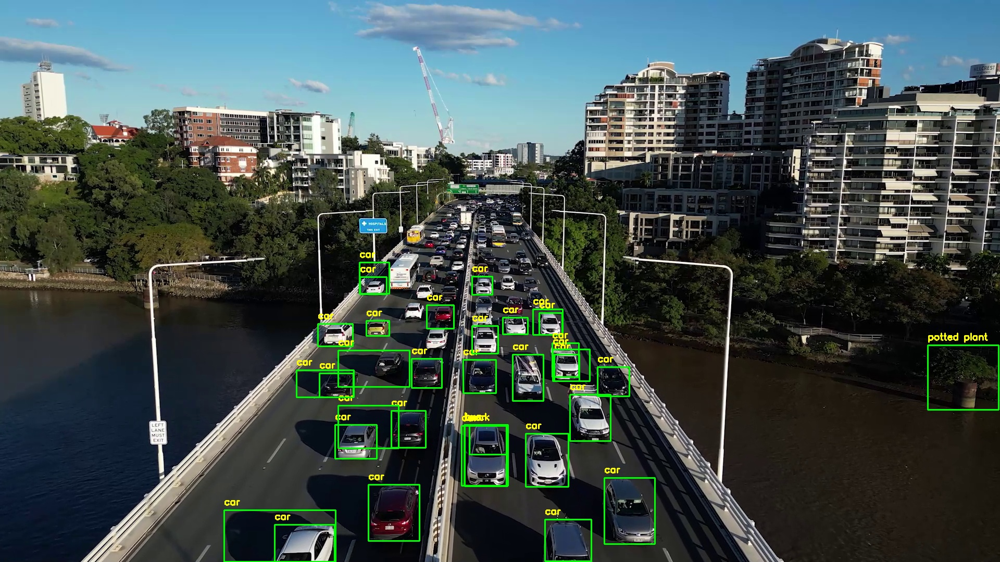

# YOLOv8 Real-Time Object Detection and Tracking System

A Python-based object detection and tracking system using YOLOv8 (nano model) for real-time detection from both video files and webcam streams.

## Features

- **Video Detection**: Process video files with object detection and tracking
- **Webcam Detection**: Real-time detection from webcam input
- **Configurable Thresholds**: Adjust confidence thresholds for detection
- **GPU Support**: Optional CUDA acceleration for faster processing
- **Multi-object Tracking**: Tracks detected objects across frames with unique IDs

## 📸 Results

### 🚶 People Tracking


### 🚗 Traffic Tracking


## 🎥 Demo Video

Watch the demo here: [Google Drive Link](https://drive.google.com/drive/folders/1xxTx5bGFYYdHPKiUTj99Q332twr5djuQ?usp=sharing)

## Project Structure

```
YOLOv8-Object-Detection-System/
├── src/
│   ├── video_detection.py      # Video file processing
│   └── webcam_detection.py     # Webcam real-time detection
├── models/
│   └── .gitkeep                # YOLOv8 Nano model (auto-downloads if missing)
├── assets/
│   ├── people_tracking.jpg     # People tracking demo
│   └── traffic_tracking.jpg    # Traffic tracking demo
├── requirements.txt            # Python dependencies
├── README.md                   # This file
└── .gitignore                 # Git ignore rules
```

## Installation

1. **Clone or download this repository**

2. **Install Python dependencies**:
   ```bash
   pip install -r requirements.txt
   ```

   The YOLOv8 model will automatically download on first run if not present in the `models/` directory.

## Usage

### Video Detection

Process a video file with object detection:

```bash
python src/video_detection.py
```

**Configuration** (edit `src/video_detection.py`):
- `VIDEO_PATH`: Path to video file (default: `videos/people_walking.mp4`)
- `MODEL_PATH`: Path to YOLO model (default: `models/yolov8n.pt`)
- `CONF_THRESHOLD`: Detection confidence threshold (default: 0.3)

**Controls**:
- `ESC`: Exit the application
- Click window close button: Exit the application

### Webcam Detection

Real-time detection from your webcam:

```bash
python src/webcam_detection.py
```

**Configuration** (edit `src/webcam_detection.py`):
- `CAMERA_INDEX`: Webcam index (0 for default camera)
- `MODEL_PATH`: Path to YOLO model (default: `models/yolov8n.pt`)
- `CONF_THRESHOLD`: Detection confidence threshold (default: 0.3)

**Controls**:
- `ESC`: Exit the application
- Click window close button: Exit the application

## GPU Acceleration

To use CUDA for faster processing, uncomment the GPU line in either script:

```python
model = YOLO(MODEL_PATH).to("cuda")  # ← uncomment for GPU
```

**Requirements**:
- CUDA-capable GPU
- NVIDIA drivers installed
- PyTorch with CUDA support

## Configuration Options

### Confidence Threshold (`CONF_THRESHOLD`)
- Range: 0.0 - 1.0
- Lower values detect more objects but may include false positives
- Higher values are more selective (default: 0.3)

### Colors
- `BOX_COLOR`: Bounding box color (BGR format)
- `TEXT_COLOR`: Label text color (BGR format)

### Font Settings
- `FONT_SCALE`: Text size
- `THICKNESS`: Box and text line thickness

## Model Information

- **Model**: YOLOv8 Nano (yolov8n)
- **Size**: ~6.2 MB
- **Speed**: Fast inference on CPU and GPU
- **Accuracy**: Good balance between speed and accuracy
- **Classes**: Detects 80 different object classes (COCO dataset)

## Troubleshooting

### "Failed to grab frame" Error
- Check that the video file exists at the specified path
- Ensure the video file is not corrupted
- Try with a different video file

### "Could not open webcam" Error
- Ensure your webcam is connected and not used by another application
- Try changing `CAMERA_INDEX` to 1 or 2 if you have multiple cameras
- Check camera permissions

### Low FPS / Slow Performance
- Lower the video resolution
- Increase `CONF_THRESHOLD` to reduce processing overhead
- Enable GPU acceleration if available
- Use a less demanding model (larger models are slower)

## Requirements

- Python 3.8+
- OpenCV (`opencv-python`)
- Ultralytics YOLOv8
- PyTorch
- NumPy

See `requirements.txt` for specific versions.

## License

This project uses YOLOv8 which is licensed under AGPL-3.0. Ensure you comply with the license when using it for your projects.

## Resources

- [YOLOv8 Documentation](https://docs.ultralytics.com/)
- [OpenCV Documentation](https://opencv.org/)
- [PyTorch Documentation](https://pytorch.org/docs/)

## Notes

- The model auto-downloads on first run if not present in the `models/` directory
- GPU acceleration is optional; CPU inference is supported
- Tracking works best with consistent frame rate and good lighting
- For better results on custom objects, consider fine-tuning with your own dataset
