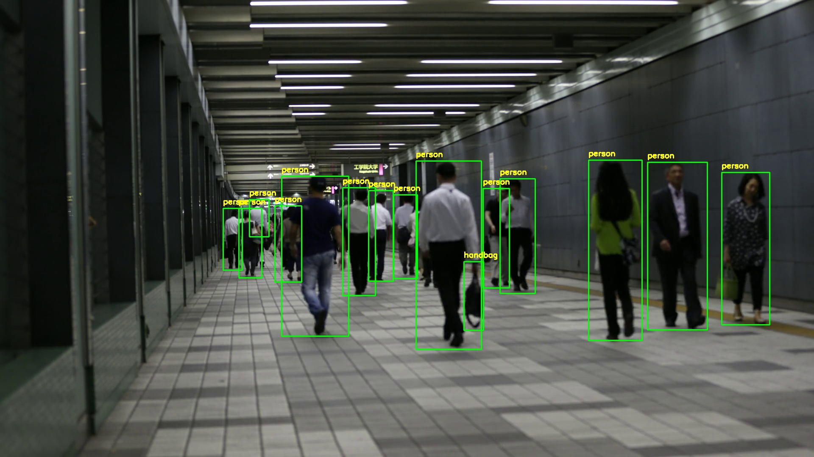

# YOLOv8 Object Detection and Tracking System

A Python-based object detection and tracking system using YOLOv8 (nano model) for inference on both pre-recorded video files and live webcam streams. The system draws bounding boxes with class labels, confidence scores, and persistent track IDs in real time, using only the pretrained COCO weights without any domain-specific adaptation.

---

## What It Does

The system runs YOLOv8 in tracking mode on either a video file or a webcam feed, filters detections by a configurable confidence threshold, and renders annotated output to a display window. Track IDs are assigned across frames with Ultralytics' `track(..., persist=True)` API, so object identities can persist when the model maintains a stable association.

It is designed as a general-purpose detection baseline: useful for prototyping, demonstrations, and understanding model behavior on real-world input, but not intended as a production-ready perception system without further adaptation.

---

### People Tracking Preview


---

## Key Features

- **Video file processing** with frame-by-frame YOLOv8 tracking
- **Live webcam tracking** from any OpenCV-accessible camera index
- **Configurable confidence threshold** to balance recall and precision
- **Optional CUDA acceleration** via PyTorch for faster inference
- **Persistent track IDs** for more stable labels across consecutive frames
- **80-class COCO detection** — no custom training required to run out of the box

---

## How It Works

```
Input (Video File or Webcam Frame)
    │
    ▼
YOLOv8n Inference
    │   (single forward pass per frame; no temporal context)
    │
    ▼
Confidence Filtering (CONF_THRESHOLD)
    │
    ▼
Bounding Box + Label Rendering (OpenCV)
    │
    ▼
Display Window
```

Each frame is processed sequentially. The tracker tries to preserve identities between frames, but track continuity can still break under occlusion, blur, or abrupt motion.

---

## Project Structure

```
YOLOv8-Object-Detection-System/
├── src/
│   ├── video_detection.py      # Video file processing
│   └── webcam_detection.py     # Webcam real-time detection
├── models/
│   └── .gitkeep                # YOLOv8n model (auto-downloads on first run)
├── assets/
│   ├── people_tracking.jpg
│   └── ...
├── requirements.txt
├── README.md
└── .gitignore
```

---

## Setup and Usage

### Prerequisites

```bash
pip install -r requirements.txt
```

YOLOv8n weights (`yolov8n.pt`) download automatically on first run if not present in `models/`.

### Video Detection

```bash
python src/video_detection.py
```

Configuration (edit directly in `video_detection.py`):

| Parameter | Default | Description |
|---|---|---|
| `VIDEO_PATH` | `videos/people_walking.mp4` | Path to input video |
| `MODEL_PATH` | `models/yolov8n.pt` | YOLOv8 weights |
| `CONF_THRESHOLD` | `0.3` | Minimum detection confidence |

### Webcam Detection

```bash
python src/webcam_detection.py
```

| Parameter | Default | Description |
|---|---|---|
| `CAMERA_INDEX` | `0` | Webcam index (try 1 or 2 for additional cameras) |
| `MODEL_PATH` | `models/yolov8n.pt` | YOLOv8 weights |
| `CONF_THRESHOLD` | `0.3` | Minimum detection confidence |

**Controls:** `ESC` or window close button to exit.

### GPU Acceleration

```python
model = YOLO(MODEL_PATH).to("cuda")  # uncomment in either script
```

Requires a CUDA-capable GPU, NVIDIA drivers, and a PyTorch build with CUDA support.

---

## Example Output

Demo video: [Google Drive](https://drive.google.com/drive/folders/1xxTx5bGFYYdHPKiUTj99Q332twr5djuQ?usp=sharing)

---

## Limitations

These are genuine constraints of the current design, not implementation bugs.

**1. Dependence on COCO classes limits real-world utility.**
The model detects only the 80 COCO object categories. Anything outside that set — custom products, lab equipment, domain-specific tools — will be missed or forced into the nearest COCO class with low confidence.

**2. Sensitivity to lighting and motion quality.**
Detection quality degrades under low light, strong backlighting, rapid illumination changes, and motion blur. No preprocessing such as histogram equalization or exposure normalization is applied before inference.

**3. Tracking is not perfectly stable.**
The tracker assigns IDs across frames, but identities can still flicker under occlusion, abrupt motion, or small appearance changes. That makes long-term counting or trajectory analysis less reliable than in a dedicated tracking pipeline.

---

## Possible Improvements

**Fine-tuning on a domain-specific dataset.**
Training or fine-tuning on images from the target environment is the most impactful improvement available. Even a modest labeled dataset can substantially reduce misclassification and improve recall for classes relevant to the deployment context.

**Preprocessing for low-light conditions.**
Applying adaptive histogram equalization (CLAHE) or a learned low-light enhancement model before passing frames to the detector can recover detection quality in poorly lit environments without retraining the detector itself.

**Higher input resolution or model scaling for small objects.**
Running inference at a larger image size, or switching from YOLOv8n to YOLOv8s/YOLOv8m, improves detection of small objects at the cost of increased latency.

---

## Model Information

| Property | Value |
|---|---|
| Model | YOLOv8 Nano (`yolov8n.pt`) |
| Weights size | ~6.2 MB |
| Training data | COCO 2017 |
| Detection classes | 80 |
| Input resolution | 640×640 (default) |
| Inference target | CPU or CUDA GPU |

---

## Requirements

- Python 3.8+
- `ultralytics`
- `opencv-python`
- `torch`
- `numpy`

See `requirements.txt` for pinned versions.

---

## Troubleshooting

**"Failed to grab frame"** — verify the video file path and that the file is not corrupted.

**"Could not open webcam"** — check that the camera is not in use by another process, and try `CAMERA_INDEX = 1` or `2` if multiple cameras are connected.

**Low FPS** — reduce input resolution, increase `CONF_THRESHOLD` to skip marginal detections faster, or enable CUDA acceleration.

---

## License

YOLOv8 is licensed under AGPL-3.0 (Ultralytics). Ensure compliance when deploying or distributing.

## Resources

- [Ultralytics YOLOv8 Documentation](https://docs.ultralytics.com/)
- [OpenCV Documentation](https://opencv.org/)
- [PyTorch Documentation](https://pytorch.org/docs/)
